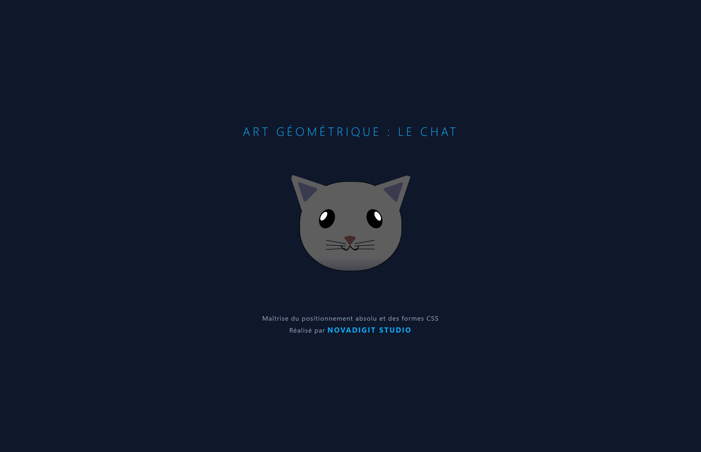

# CSS Cat Painting 🐱

Ce projet démontre l'utilisation créative des propriétés CSS pour dessiner des formes organiques et des personnages. C'est un exercice de précision sur le positionnement et la manipulation de formes géométriques.

### Compétences techniques validées :
- **Advanced Shapes** : Utilisation intensive de `border-radius` pour créer des courbes complexes (oreilles, yeux, visage).
- **Positioning** : Maîtrise des positions `absolute` et `relative` pour assembler les éléments du visage.
- **Z-Index** : Gestion de l'empilement des calques pour créer de la profondeur (moustaches, pupilles).
- **CSS Selectors** : Utilisation de sélecteurs avancés pour cibler des éléments spécifiques de l'illustration.

### Aperçus

*Version NovaDigit Studio*

---

### 🎓 Origine du projet
Ce projet a été réalisé dans le cadre du cursus [Responsive Web Design de freeCodeCamp](https://www.freecodecamp.org/learn/2022/responsive-web-design/). C'est un atelier pratique qui permet de maîtriser l'assemblage de composants UI complexes.

---
*Développé avec passion pour **NovaDigit Studio**.*
