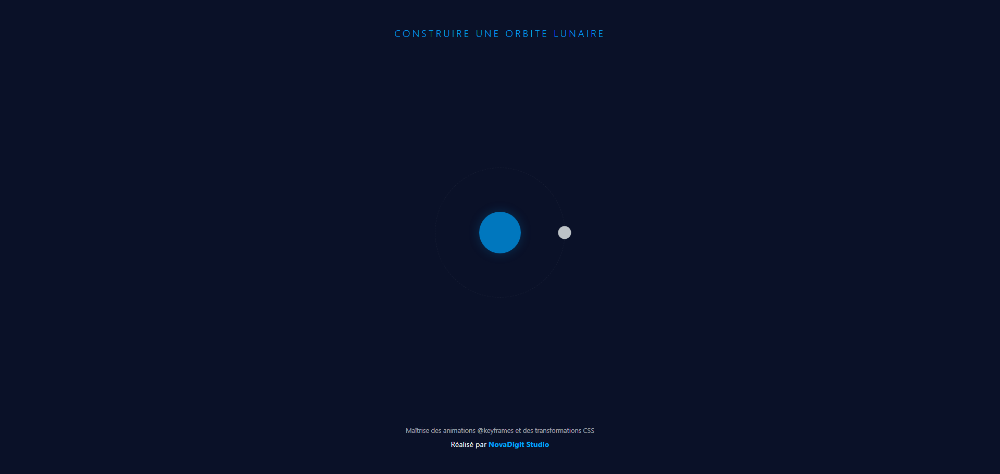
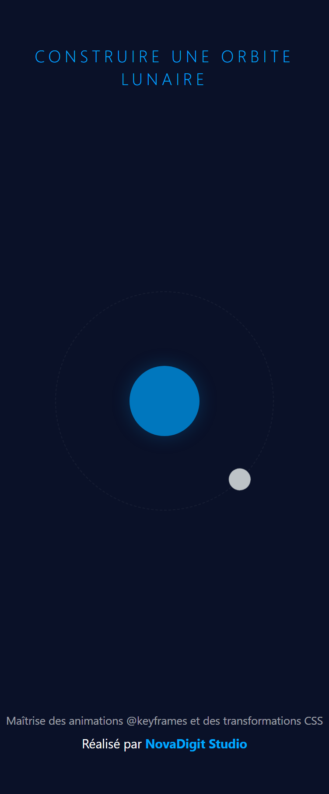

# Construire une Orbite Lunaire - NovaDigit Studio

Ce projet est une application web d'animation réalisée dans le cadre du cursus de certification **Responsive Web Design** de **freeCodeCamp**. L'objectif est de créer une animation fluide de la Lune orbitant autour de la Terre en utilisant exclusivement **HTML5** et **CSS3**.

Ce laboratoire met l'accent sur la maîtrise des transformations complexes (`transform`), du positionnement absolu et de la gestion des animations cycliques avec les `@keyframes`.

## Aperçu du projet

### Version Bureau (Desktop)

### Version Mobile

## Objectifs d'apprentissage

Ce projet a permis de valider les compétences suivantes :
* **Positionnement Absolu Avancé** : Centrage précis d'éléments dans un conteneur parent en utilisant le combo `top: 50%`, `left: 50%` et `transform: translate(-50%, -50%)`.
* **Animations CSS (@keyframes)** : Création d'une rotation infinie à 360 degrés sans décalage visuel.
* **Hiérarchie Z-index** : Gestion de l'empilement des éléments (Terre, Orbite, Lune) pour un rendu visuel cohérent.
* **Cohérence Visuelle NovaDigit Studio** : Intégration du projet dans une charte graphique unifiée (fond bleu nuit profond, typographie espacée, footer signature).

## Technologies utilisées

* **HTML5** : Structure sémantique du système orbital et du footer.
* **CSS3** : 
    * Flexbox pour le layout global.
    * Animations personnalisées pour le mouvement orbital.
    * Variables CSS (`:root`) pour une gestion rigoureuse de la palette de couleurs NovaDigit.

## Structure du Projet

Le projet suit la structure standard de NovaDigit Studio pour assurer une intégration fluide dans le hub global :
* Un `header` avec un titre en majuscules et espacement large.
* Un `main` centré pour l'animation.
* Un `footer` signature incluant la mention de maîtrise technique et le branding NovaDigit Studio.

---
<footer class="footer">
  
Maîtrise des animations @keyframes et des transformations CSS

  
Réalisé par NovaDigit Studio

</footer>
