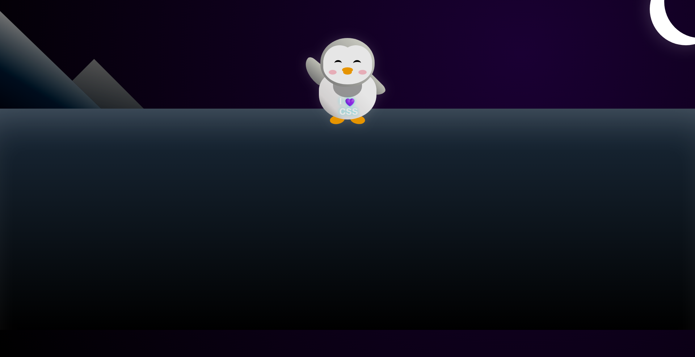

# Penguin Lab 🐧

Ce projet est un exercice approfondi sur l'utilisation des variables CSS et la construction de formes complexes. L'objectif initial est de manipuler les propriétés de positionnement et les pseudo-éléments pour donner vie à un personnage interactif.

### Compétences techniques validées :
- **CSS Variables** : Utilisation intensive de `:root` pour piloter la palette de couleurs du personnage de manière centralisée.
- **Pseudo-elements** : Maîtrise de `::before` et `::after` pour ajouter des détails morphologiques sans surcharger le HTML.
- **Complex Shapes** : Utilisation de `border-radius` avec des valeurs multiples pour sculpter les courbes du manchot et son environnement.
- **Dynamic Lighting (NovaDigit Extension)** : Développement d'un Dark Mode réactif au clic sur l'astre, intégrant des jeux d'ombres et de lumières sur les montagnes (Rim Light).

### Aperçus

*Version Light Mode (Atelier FCC)*

*Version Dark Mode (NovaDigit Extension)*

---

### 🎓 Origine du projet
Ce projet a été réalisé dans le cadre du cursus [Responsive Web Design de freeCodeCamp](https://www.freecodecamp.org/learn/2022/responsive-web-design/). C'est un atelier guidé qui permet de maîtriser l'architecture CSS. Pour pousser l'exercice plus loin, j'ai travaillé avec mon partenaire IA pour implémenter un basculement d'environnement complet et un éclairage nocturne dynamique.

---
*Développé avec passion pour **NovaDigit Studio**.*
