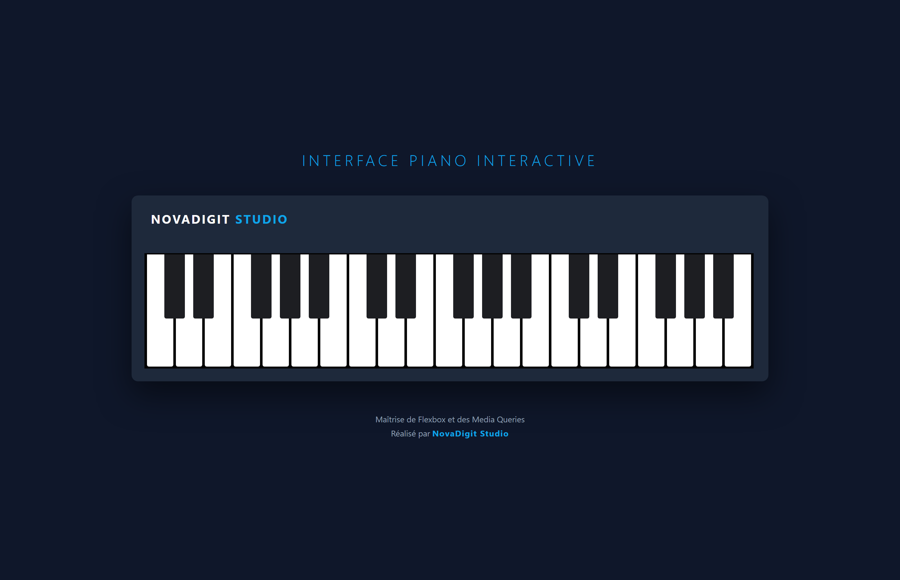
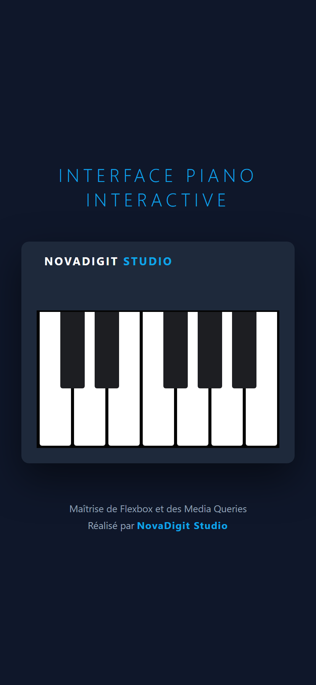

# CSS Piano 🎹

Ce projet explore la création d'interfaces interactives et responsives en utilisant exclusivement Flexbox. L'objectif était de simuler un clavier de piano réaliste avec une gestion précise du positionnement et du découpage visuel.

### Compétences techniques validées :
- **Flexbox Layout** : Alignement rigoureux des touches blanches et noires.
- **Interactivité CSS** : Utilisation des pseudo-classes (`:hover`, `:active`) pour simuler l'appui sur les touches avec la charte NovaDigit.
- **Responsive Design** : Gestion intelligente du débordement via `overflow: hidden` pour maintenir la taille des touches sur mobile.
- **Shadows & Depth** : Effets de profondeur sur le châssis pour un rendu premium.

### Aperçus

*Version Desktop*

*Version Mobile (Vue rognée)*

---

### 🎓 Origine du projet
Ce projet a été réalisé dans le cadre du cursus [Responsive Web Design de freeCodeCamp](https://www.freecodecamp.org/learn/2022/responsive-web-design/). C'est une excellente mise en pratique de la flexibilité du Web Design moderne et des media queries.

---
*Développé avec passion pour **NovaDigit Studio**.*
