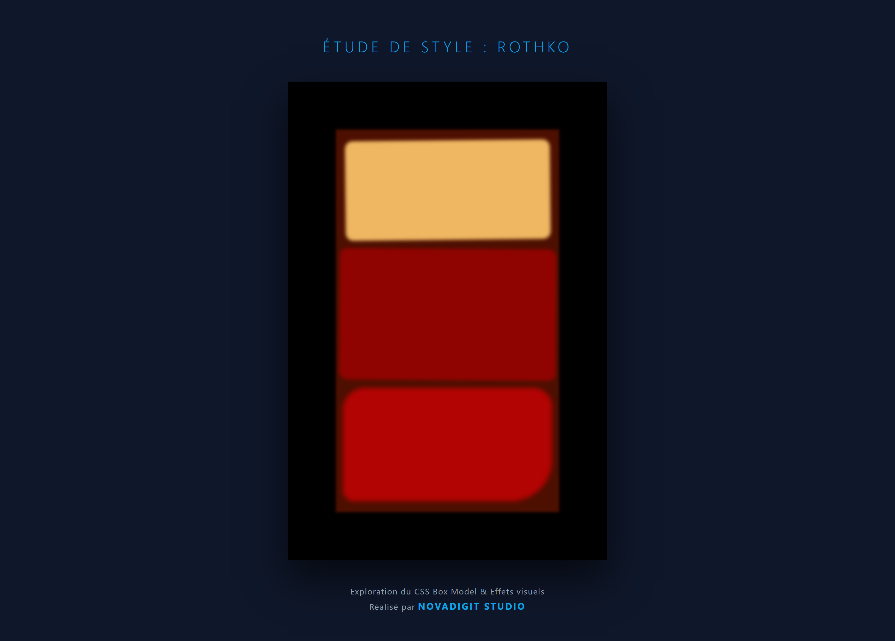

# 🎨 Rothko Style Study - NovaDigit Studio

Cette étude de style fait partie de mon apprentissage du design visuel avec CSS. L'objectif était de reproduire l'esthétique des peintures de Mark Rothko en utilisant uniquement des propriétés CSS avancées.

## 🧪 Concepts Techniques explorés

* **Box Model :** Utilisation précise des marges, paddings et bordures pour créer un cadre de tableau réaliste.
* **Filtres Visuels :** Application de `filter: blur()` pour imiter les bords doux et diffus de la peinture à l'huile.
* **Effets d'Ombre :** Utilisation de `box-shadow` pour donner de la profondeur et de la texture aux couches de couleur.
* **Transformations :** Légères rotations (`transform: rotate`) pour casser la rigidité du numérique et donner un aspect "peint à la main".

## 🛠️ Personnalisation NovaDigit Studio

Bien que l'exercice soit basé sur le programme freeCodeCamp, j'ai adapté l'interface avec la charte graphique de **NovaDigit Studio** :
* **Interface Responsive :** Adaptation du canvas pour qu'il soit consultable sur mobile et tablette.
* **Typographie & Couleurs :** Utilisation du thème sombre (Bleu Nuit & Cyan) pour la mise en page globale.

---
*Projet réalisé par NovaDigit Studio.*
