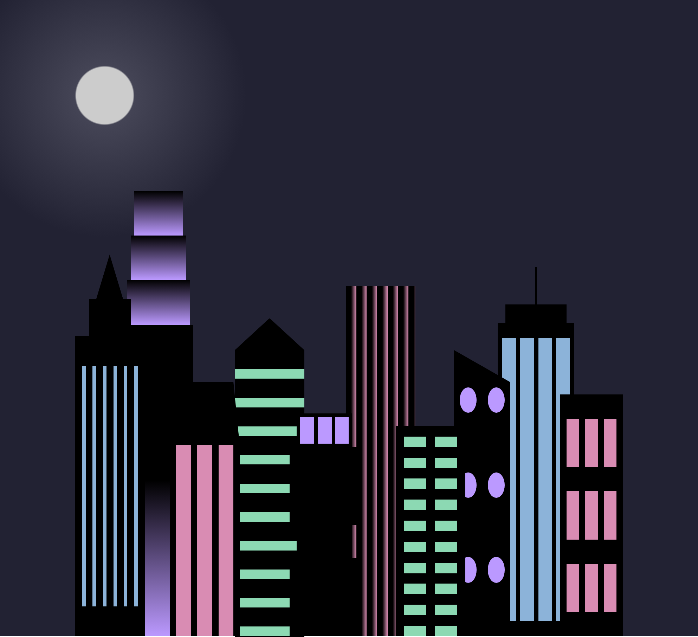

# Skyline City 🏙️

Ce projet est une démonstration de création artistique via le code. Il s'agit d'une ligne d'horizon urbaine dynamique avec un mode nuit automatique.

### Compétences techniques validées :
- **CSS Art** : Création de textures complexes avec `repeating-linear-gradient`.
- **Architecture CSS** : Gestion d'une palette dynamique via les variables `:root`.
- **Responsive Design** : Adaptation des couleurs et des formes via les `@media` queries.
- **Superposition** : Maîtrise des calques de background multiples.

### Aperçus

*Version Desktop*

*Version Mobile (Mode Nuit)*

---

### 🎓 Origine du projet
Ce projet a été réalisé dans le cadre du cursus [Responsive Web Design de freeCodeCamp](https://www.freecodecamp.org/learn/2022/responsive-web-design/). C'est un atelier pratique qui permet de pousser la manipulation des dégradés CSS dans leurs retranchements.

---
*Développé avec passion pour **NovaDigit Studio**.*
